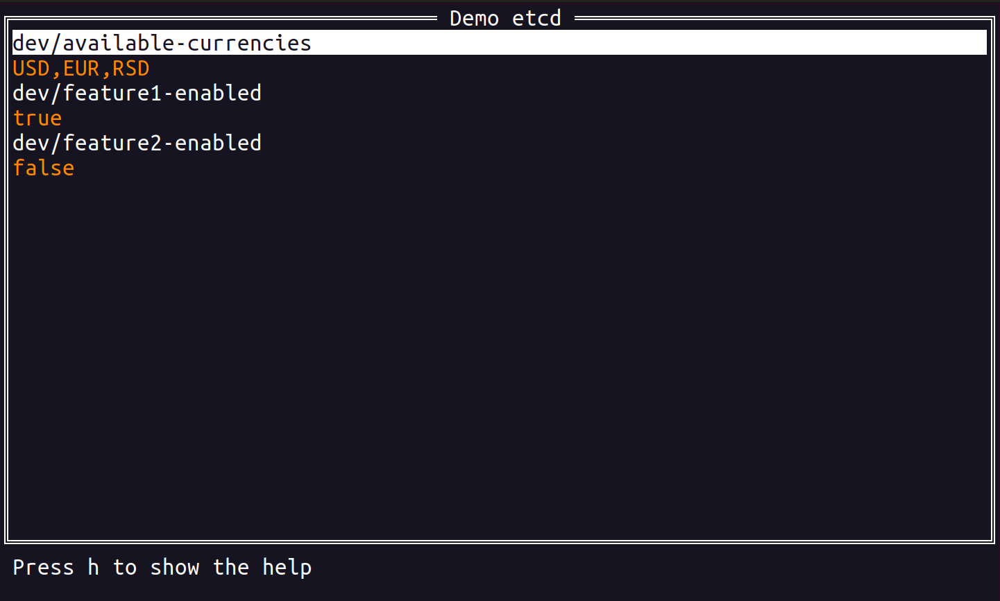

# etcd terminal user interface client

What is [etcd](https://etcd.io/)?
> A distributed, reliable key-value store for the most critical data of a distributed system

#### Current features

- list key-values
- add a new key-value
- delete a key-value
- edit a value



## Installation

#### Homebrew tap

```bash
brew install aleksandersh/etcd-tui/etcd-tui
```

#### Go install

Requires Go 1.22

```bash
go install github.com/aleksandersh/etcd-tui@latest
```

## Usage

```bash
# version
$ etcd-tui --version
# ask for help
$ etcd-tui --help
# launch user interface
$ etcd-tui localhost:2379 --user user1 --password password1
```

## Demo

```bash
# start the demo etcd server using docker
$ make demo-etcd-docker-up
# connect to the server using etcd-tui
$ make demo-connect
# stop demo docker
$ make demo-etcd-docker-down
```
